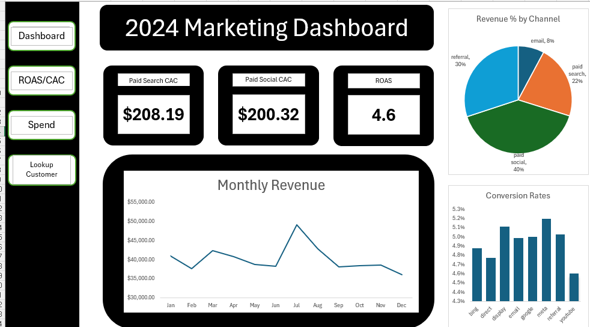

# B2B Full-Funnel Marketing Performance Project

This project shows a full B2B marketing and revenue funnel built from raw data.  
I cleaned and prepared all datasets in **SQL**, and created the final visualizations and performance dashboard in **Excel**.

---

## What This Project Covers

- Web sessions and UTM performance  
- Email engagement  
- Lead → Opportunity → Closed-Won funnel  
- Sales activities  
- Pipeline and revenue  
- Channel influence  
- First-touch, last-touch, and multi-touch attribution  
- LTV, churn, and customer segmentation  

All SQL scripts used for cleaning and modeling are included in the `sql/` folder.

---

## Dashboard (Excel)

The main dashboard is included as:

- **b2b_marketing_dashboard.png** (preview image)  
- **b2b_marketing_performance_dashboard.xlsx** (full interactive file)

---

## Key Analytics Included

- Lead source performance  
- Conversion rates across the full funnel  
- CAC and spend analysis  
- Channel influence on opportunities, pipeline, and revenue  
- First-touch, last-touch, and linear multi-touch attribution  
- LTV by industry and ABM vs non-ABM customers  

---

## Tools Used
- **SQL Server** (data cleaning, standardization, modeling)  
- **Excel** (visualization and dashboard)  

---

## What This Demonstrates

- Ability to clean messy marketing data  
- Build reliable staging tables  
- Create attribution models from raw UTM + activity data  
- Connect marketing activity directly to revenue  
- Build practical dashboards for marketing & sales teams  

---

If you're reviewing this for a marketing analytics role, thanks for taking a look.
